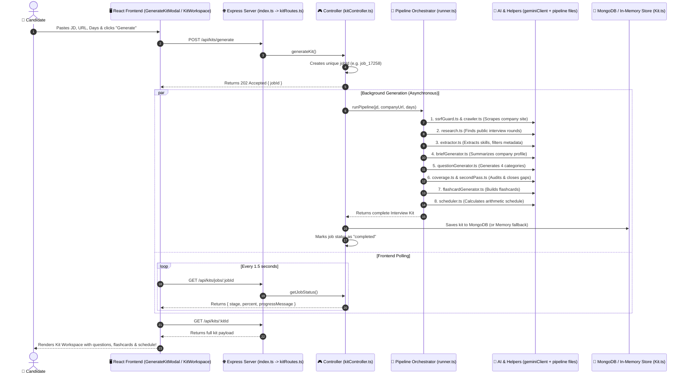

# AI Interview Prep Kit 🎯

> **A full-stack application that transforms any Job Description (JD) and Company URL into a complete, tailored interview preparation kit with grounded questions, concept flashcards, and a day-by-day study schedule.**

---

Live Link - https://ai-interview-prep-kit-ten.vercel.app/

## 1. Project Overview

### The Problem
When candidates prepare for job interviews:
1. **Generic Preparation:** Most online resources provide generic interview questions (e.g. *"What is React?"*) that are not tailored to the specific company, domain, or role requirements.
2. **AI Hallucinations & Noise:** Standard AI prompts often treat job metadata (e.g. *"Full-time"*, *"Bangalore"*, *"Health Insurance"*, *"Our Mission"*) as interview qualifications, generating nonsensical questions like *"What is Full-time and how do you use it?"*.
3. **No Verifiable Coverage:** Candidates have no way to verify whether 100% of the mandatory job requirements have actually been covered by their study material.

### The Solution
This application takes **3 inputs**:
1. **Job Description (JD)**
2. **Company Website URL**
3. **Preparation Days (e.g. 5 days)**

And produces a complete, production-grade interview preparation workspace:
- **Clean Requirements:** Distinguishes genuine skills from employment metadata, salary ranges, location, and corporate boilerplate.
- **Company Research Brief:** Scrapes the company website and extracts public candidate interview signals.
- **Targeted Questions across 4 Categories:** `Technical`, `Behavioural`, `System Design`, and `Company Fit`, with every question grounded to specific requirement IDs.
- **Deterministic Coverage Audit:** Uses mathematical set logic (not AI) to guarantee 100% of must-have skills are covered, running an automatic second pass if any gaps exist.
- **Concept Flashcards:** Interactive study cards with concept terminology on the front and plain-English definitions on the back.
- **Deterministic Study Schedule:** Allocates questions across $N$ days with integer minutes using pure arithmetic (no AI math errors).
- **Interactive Studio:** Allows candidates to edit, pin, reorder, add custom questions, and practice with 3D flip-card drills.

---

## 2. Request Journey: How Code Travels (Step-by-Step)

When a user clicks **"Generate Kit"** on the frontend, here is the exact journey the request takes through the system:



---

## 3. Backend File-by-File Architecture

```text
backend/
├── index.ts                      # 🚪 Entry Point: Initializes Express, DB & Routes
├── config/
│   └── database.ts               # 🔌 MongoDB connection & credential masking
├── routes/
│   ├── authRoutes.ts             # 🛣️ /api/auth endpoint routes
│   └── kitRoutes.ts              # 🛣️ /api/kits endpoint routes
├── controllers/
│   ├── authController.ts         # 👤 Handles register, login, and JWT issuance
│   └── kitController.ts          # 📦 Handles kit generation jobs, polling, and updates
├── middlewares/
│   ├── authMiddleware.ts         # 🛡️ Verifies JWT tokens in request headers
│   └── errorHandler.ts           # ⚠️ Global error handler
├── models/
│   ├── User.ts                   # 🗄️ Mongoose schema for user accounts
│   └── Kit.ts                    # 🗄️ Mongoose schema for kits + In-Memory fallback store
├── pipeline/                     # 🧠 AI & Core Business Logic
│   ├── runner.ts                 # 🚦 Master Coordinator: Runs pipeline stages in order
│   ├── geminiClient.ts           # 🤖 LLM Client: Rate limiter, backoff, and multi-model pool
│   ├── ssrfGuard.ts              # 🔒 Security: Blocks private IPs & cloud metadata attacks
│   ├── crawler.ts                # 🕷️ Web Scraper: Scrapes company homepage and hiring links
│   ├── research.ts               # 🔍 Research: Discovers public interview formats & rounds
│   ├── extractor.ts              # ✂️ Extractor: Extracts skills & filters out metadata
│   ├── briefGenerator.ts         # 📝 Brief: Synthesizes company summary & domain
│   ├── questionGenerator.ts      # ❓ Generator: Produces questions across 4 isolated categories
│   ├── coverage.ts               # 📊 Auditor: Pure set-math checking of must-have requirements
│   ├── secondPass.ts             # 🔁 Pass 2: Generates questions for uncovered gap skills
│   ├── flashcardGenerator.ts     # 🃏 Flashcards: Creates concept cards for revision
│   ├── scheduler.ts              # 📅 Scheduler: Pure arithmetic day-by-day timetable
│   └── schema.ts                 # 📐 Schemas: Zod schemas & TypeScript interfaces
└── cli/
    └── evaluate.ts               # 💻 CLI: Headless batch evaluator for assignment cases
```

---

### Detailed File Guide

#### 1. `backend/index.ts`
- **What it does:** The main entry point of the backend server.
- **How it connects:** Starts Express, attaches CORS and JSON body-parser middlewares, connects to MongoDB via `database.ts`, and mounts `/api/auth` and `/api/kits` routers.
- **Health Check:** Exposes `GET /api/health` which reports server uptime and configured LLM keys.

#### 2. `backend/config/database.ts`
- **What it does:** Connects Mongoose to the MongoDB database.
- **Security Feature:** Automatically masks passwords and usernames in the connection string so sensitive credentials are never printed to terminal logs.

#### 3. `backend/routes/kitRoutes.ts` & `controllers/kitController.ts`
- **`kitRoutes.ts`:** Defines HTTP endpoints:
  - `POST /generate` $\to$ Starts background kit generation.
  - `GET /jobs/:jobId` $\to$ Polls generation stage and percentage.
  - `GET /:id` $\to$ Returns the complete kit data.
  - `PUT /:id` $\to$ Saves inline question edits, pins, and reorders.
  - `POST /:id/regenerate-section` $\to$ Regenerates a single category or company brief.
- **`kitController.ts`:**
  - Manages asynchronous generation jobs via an in-memory `activeJobs` Map.
  - **In-Memory Fallback:** If MongoDB is offline, it automatically stores kits in an in-memory Map (`inMemoryKits`) so the application works seamlessly without requiring an active database.

#### 4. `backend/pipeline/runner.ts` (The Master Coordinator)
- **What it does:** Orchestrates the entire pipeline from raw inputs to the finished kit.
- **Execution Order:**
  1. Calls `crawler.ts` to fetch and parse company pages.
  2. Calls `research.ts` to check for candidate interview signals.
  3. Calls `extractor.ts` to extract and classify requirements from the JD.
  4. Calls `briefGenerator.ts` to create the factual company overview.
  5. Calls `questionGenerator.ts` to build questions across 4 categories.
  6. Calls `coverage.ts` to check if all must-have requirements are covered.
  7. If gaps exist, calls `secondPass.ts` to close missing requirements.
  8. Calls `flashcardGenerator.ts` to build revision flashcards.
  9. Calls `scheduler.ts` to calculate the day-by-day study schedule.
  10. Returns the complete kit matching the Appendix A schema.

#### 5. `backend/pipeline/geminiClient.ts` (The AI Engine)
- **What it does:** Connects to Google Gemini API to generate structured JSON and text.
- **Resilience & Rate Limit Handling:**
  - **In-Memory Throttle:** Mandates a 2-second interval between calls to ensure compliance with free-tier 15 RPM (requests per minute) limits.
  - **Exponential Backoff (`withRetry`):** Automatically catches HTTP `429 Too Many Requests` and retries up to 3 times with exponential delays and random jitter (2.5s $\to$ 5s $\to$ 10s).
  - **Multi-Model Pool Failover:** If a specific model's quota is exhausted, it seamlessly switches to the next model:
    `gemini-3.5-flash-lite` $\to$ `gemini-flash-lite-latest` $\to$ `gemini-3.1-flash-lite` $\to$ `gemini-3.5-flash`.
  - **Optional Multi-Provider Fallback:** If `OPENAI_API_KEY` or `GROQ_API_KEY` are provided in `.env`, they automatically serve as backups if all Gemini models fail.

#### 6. `backend/pipeline/ssrfGuard.ts` & `crawler.ts`
- **`ssrfGuard.ts`:** Validates URLs against Server-Side Request Forgery (SSRF). Resolves DNS hostnames to IP addresses and blocks private ranges (`10.x`, `192.168.x`, `127.0.0.1`, loopbacks) and AWS metadata IPs (`169.254.169.254`).
- **`crawler.ts`:** Respects `/robots.txt`, downloads the root page (capped at 500KB), and scores internal links to locate careers and hiring pages.

#### 7. `backend/pipeline/extractor.ts`
- **What it does:** Extracts clean, interview-worthy requirements from raw job descriptions.
- **Classification Gate (`classifyRequirementItem`):**
  - **Filters Out:** Employment metadata (`"Full-time"`, `"Contract"`), locations (`"Bangalore"`, `"Remote"`), benefits (`"Health insurance"`, `"401k"`), and company slogans (`"Our mission is to change..."`).
  - **Retains:** Real candidate qualifications (`"React 18"`, `"Node.js REST APIs"`, `"Docker"`, `"System Architecture"`).
  - Assigns each requirement an ID (`r1`, `r2`...), kind (`technical`, `behavioural`, `domain`), and priority (`must`, `nice`).

#### 8. `backend/pipeline/questionGenerator.ts`
- **What it does:** Generates interview questions in **4 separate, focused categories**:
  1. `technical`: Code mechanisms, internal mechanics, debugging.
  2. `behavioural`: Team conflicts, ownership, STAR method scenarios.
  3. `system-design`: Scalability, caching, microservices, architecture trade-offs.
  4. `company-fit`: Alignment with company products, values, and engineering culture.
- **Key Guards:**
  - Every question is explicitly grounded to at least one `requirement_id`.
  - Anti-template filter detects and rewrites repetitive patterns (e.g. *"How have you applied X to solve critical challenges..."*).
  - Enforces plain, international English in questions and 3–5 bulleted answer outlines.

#### 9. `backend/pipeline/coverage.ts` & `secondPass.ts`
- **`coverage.ts` (Pure Deterministic Math):**
  - Evaluates must-have coverage using set difference:
    $$\text{Uncovered Must IDs} = \text{All Must Requirements} \setminus \bigcup (\text{Question Requirement IDs})$$
- **`secondPass.ts` (AI Gap Closure):**
  - If any must-have requirements are uncovered, it sends a targeted prompt requesting exactly 1 question for each missing requirement, closing gaps to 100%.

#### 10. `backend/pipeline/flashcardGenerator.ts`
- **What it does:** Generates 4 to 6 concept flashcards from extracted requirements.
- **Card Structure:**
  - Front: Concept terminology (e.g. `"Event Loop"`).
  - Back: Simple, plain-English definition without buzzwords.

#### 11. `backend/pipeline/scheduler.ts` (Pure Arithmetic)
- **What it does:** Allocates questions across candidate prep days into a structured timetable.
- **Why No AI Math:** LLMs frequently make arithmetic errors (e.g. distributing 12 questions over 5 days into 6 days). `scheduler.ts` uses strict arithmetic:
  - Exact day count matches requested days ($1$ to $60$).
  - Priority scoring ensures harder technical and system-design questions appear on earlier days.
  - Computes integer study minutes between 45 and 120 minutes per day.

#### 12. `backend/cli/evaluate.ts`
- **What it does:** Standalone CLI tool to run headless batch evaluations.
- **Command:** `npm run evaluate -- --input cases.json --output kits.json`
- Reads an input JSON array of cases, runs the pipeline for each case, and writes the output according to the Appendix A schema.

---

## 4. The AI Pipeline in 8 Simple Steps

```text
Input: Raw JD + Company URL + Available Days
  │
  ├── [Step 1: Web Safety & Crawl]  -> SSRF check -> Read robots.txt -> Scrape company site
  ├── [Step 2: Public Research]     -> Find Glassdoor/Reddit candidate discussion signals
  ├── [Step 3: JD Skill Extraction] -> Strip "Full-time" & "Bangalore" -> Extract real skills (r1, r2, r3)
  ├── [Step 4: Company Brief]       -> Synthesize factual overview of what company builds
  ├── [Step 5: Question Generation] -> Generate 4 separate question categories grounded to requirement IDs
  ├── [Step 6: Coverage Audit]      -> Math check: Did any must-have skills get missed?
  │                                    └── If yes: Run Second Pass to generate missing questions!
  ├── [Step 7: Concept Flashcards]  -> Build Front/Back terminology flashcards
  └── [Step 8: Study Schedule]      -> Pure arithmetic allocates questions over Day 1 to Day N
  │
Output: 100% Complete, Grounded Interview Kit!
```

---

## 5. Rate Limits & Free-Tier Resilience

The assessment specification (Page 8) explicitly requires the application to run on a **Free Tier** and handle **Rate Limits ("Slow Down")**.

The application implements a 4-tier defense:
1. **In-Memory Throttle Queue:** Maintains a minimum 2-second interval between LLM calls so requests never exceed the free-tier limit of 15 requests per minute (RPM).
2. **Exponential Backoff with Jitter:** When Google returns HTTP 429 (`Too Many Requests`), the client sleeps with exponential backoff ($2.5\text{s} \to 5\text{s} \to 10\text{s}$) plus random jitter before retrying.
3. **Multi-Model Pool Failover:** If a specific model's quota is exhausted, the pipeline immediately tries the next candidate model:
   $$\text{gemini-3.5-flash-lite} \longrightarrow \text{gemini-flash-lite-latest} \longrightarrow \text{gemini-3.1-flash-lite} \longrightarrow \text{gemini-3.5-flash}$$
4. **Secondary Multi-Provider Support:** If an `OPENAI_API_KEY` or `GROQ_API_KEY` is present in `.env`, the pipeline will automatically utilize it if all Gemini models are exhausted.

---

## 6. Frontend Overview (React + Vite)

The frontend is built as a responsive Single-Page Application (SPA) using React 18 and TailwindCSS:

| Page / Component | Purpose |
| :--- | :--- |
| **`Home.tsx`** | Dashboard displaying all previously created interview kits with quick actions. |
| **`GenerateKitModal.tsx`** | Input form where candidates paste their JD, company URL, and preparation days. |
| **`ProgressStepper.tsx`** | Animated progress bar showing real-time pipeline status polled from the backend. |
| **`KitWorkspace.tsx`** | Main editing studio where candidates can inline-edit questions, pin items, reorder questions, and regenerate specific categories. |
| **`CandidatePortal.tsx`** | Interactive study mode featuring 3D flip flashcards, question deep-dive drawers, and day-wise preparation checklist. |
| **`CoverageBadge.tsx`** | Visual gauge displaying the percentage of must-have requirements covered (Target: 100%). |

---

## 7. Local Development Setup

### Prerequisites
- **Node.js:** v18+
- **npm:** v9+
- **Gemini API Key:** Free key from [Google AI Studio](https://aistudio.google.com/).
- **MongoDB:** (Optional) If omitted, the app automatically runs on its built-in in-memory store.

### Step 1: Install Dependencies
```bash
npm run install:all
```
*(Installs root, backend, and frontend packages simultaneously).*

### Step 2: Configure Environment Variables
Create `.env` files in both the root directory and `backend/` directory:
```env
PORT=5000
NODE_ENV=development
CLIENT_URL=http://localhost:5173

# Database Connection (MongoDB URI, or leave default for in-memory fallback)
MONGODB_URI=mongodb://localhost:27017/interview_prep_kit

# Authentication Secret
JWT_SECRET=super_secret_jwt_key_for_development
JWT_EXPIRES_IN=7d

# Google Gemini API Key (Free Tier)
GEMINI_API_KEY=your_gemini_api_key_here

# Optional Fallbacks
OPENAI_API_KEY=
GROQ_API_KEY=
```

### Step 3: Run the Application
Start both the backend and frontend concurrently:
```bash
npm run dev
```

Open your browser:
- **Frontend App:** [http://localhost:5173](http://localhost:5173)
- **Backend API Health:** [http://localhost:5000/api/health](http://localhost:5000/api/health)

---

## 10. Interview Cheat-Sheet (How to Explain this Project)

When an interviewer asks about this project, here are 5 clear, concise answers you can give:

### Q1: "How did you prevent the AI from generating questions for metadata like 'Full-time' or 'Bangalore'?"
> **Answer:** *"We used a two-layer defense. First, the LLM prompt strictly instructs the model that metadata, locations, and company slogans are not candidate qualifications. Second, we built a deterministic filter called `classifyRequirementItem` in TypeScript that uses regex and context rules to automatically reject employment types, city names, compensation, and corporate boilerplate before questions can be generated."*

### Q2: "Did you use AI to check requirement coverage?"
> **Answer:** *"No. We intentionally avoided using AI for coverage checking because LLMs can hallucinate coverage. Instead, we implemented deterministic mathematical set difference in `coverage.ts`. Our code checks which `must-have` requirement IDs are missing from the question bank. If any are missing, our second-pass function triggers a targeted prompt specifically requesting questions for those uncovered IDs."*

### Q3: "How is the study schedule calculated?"
> **Answer:** *"The schedule is 100% deterministic code in `scheduler.ts`—zero AI math. The candidate's requested day count is respected as an integer range. Questions are scored by priority (must-have requirements first, then difficulty, then category) and distributed into day buckets. Integer study minutes between 45 and 120 minutes are calculated based on the day's question load."*

### Q4: "How does the system handle Gemini free-tier rate limits?"
> **Answer:** *"We implemented a 4-layer resilience strategy: an in-memory queue that throttles calls with a 2-second delay to stay below 15 RPM; exponential backoff with random jitter to retry 429 errors; an automatic multi-model failover pool that switches between 6 Gemini models if one model hits its limit; and optional fallback to OpenAI or Groq if configured."*

### Q5: "How are user edits and pinned questions preserved during regeneration?"
> **Answer:** *"Each question has an `origin` flag (`'generated'`, `'edited'`, or `'manual'`) and an `is_pinned` boolean. When a user regenerates a single category or section, the backend controller extracts and preserves all edited, manual, and pinned items, only refreshing the unedited generated questions."*
